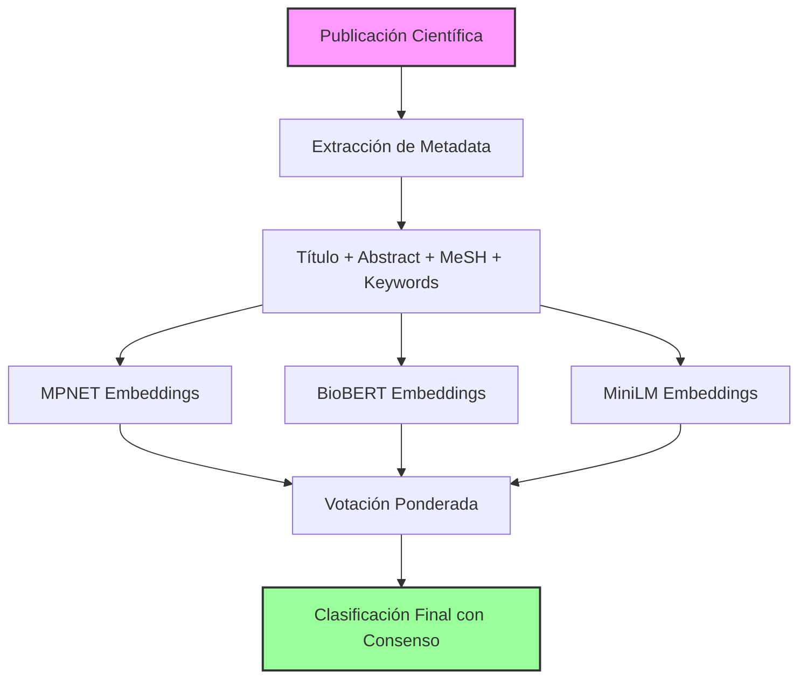

# Metodología de Clasificación - Sistema de Embeddings Avanzado

## 📋 Resumen Ejecutivo

Este documento describe el sistema avanzado de clasificación automática implementado para categorizar las 226 publicaciones científicas del Doctorado en Ciencias de la Nutrición Traslacional (DCNT) según:
- **ODS** (Objetivos de Desarrollo Sostenible)
- **PRONACES** (Programas Nacionales Estratégicos)
- **Líneas de Investigación** del programa doctoral

## 🎯 Problema Original

El sistema inicial presentaba limitaciones significativas:
- **84.5%** de clasificaciones con confianza "tentativa"
- **0%** de clasificaciones con alta confianza
- Similitud promedio de solo **0.35**
- Modelo básico (`all-MiniLM-L6-v2`) con 384 dimensiones

## 🚀 Solución Implementada: Sistema de Ensemble

### Arquitectura del Sistema



## 📊 Modelos Utilizados

### 1. MPNET (all-mpnet-base-v2)
- **Dimensiones**: 768 (vs 384 del original)
- **Peso en ensemble**: 2.0
- **Ventajas**:
  - Mayor capacidad de representación semántica
  - Mejor rendimiento en similitud de textos
  - Pre-entrenado con corpus diverso

### 2. BioBERT
- **Modelo**: `pritamdeka/BioBERT-mnli-snli-scinli-scitail-mednli-stsb`
- **Peso en ensemble**: 1.5
- **Ventajas**:
  - Especializado en literatura biomédica
  - Pre-entrenado con 4.5B palabras de PubMed
  - Comprensión superior de términos médicos

### 3. MiniLM (all-MiniLM-L6-v2)
- **Dimensiones**: 384
- **Peso en ensemble**: 1.0
- **Ventajas**:
  - Modelo ligero y rápido
  - Buena línea base para comparación
  - Eficiente en recursos

## 🔧 Técnicas de Optimización

### 1. Procesamiento de Texto Ponderado

```python
Ponderación de componentes:
- Abstract:     40%  # Información más rica
- Título:       30%  # Tema principal
- MeSH terms:   20%  # Vocabulario controlado
- Keywords:     10%  # Términos adicionales
```

### 2. Normalización L2

Todos los embeddings son normalizados usando norma L2:
```python
embedding_normalized = embedding / ||embedding||₂
```

**Beneficios**:
- Similitudes en rango [0, 1]
- Comparación más justa entre vectores
- Estabilidad numérica mejorada

### 3. Múltiples Representaciones por Categoría

Cada categoría (ODS, PRONACES, Línea) tiene 3 representaciones:
1. **Descripción técnica**: Términos formales y científicos
2. **Términos MeSH**: Vocabulario biomédico controlado
3. **Outcomes esperados**: Impactos y resultados

### 4. Boost Específico del Dominio

Aplicación de incrementos basados en:
- Presencia de términos MeSH relevantes (+0.05)
- Keywords en título (+0.03)
- Términos biomédicos en abstract (+0.01)

### 5. Expansión de Términos MeSH

```python
Ejemplo de expansión:
"Diabetes" → ["Diabetes Mellitus", "Type 2 Diabetes",
             "Diabetes Complications", "Diabetic Nephropathy"]
```

## 📈 Proceso de Clasificación

### Paso 1: Preparación de Datos
```python
1. Cargar publicación desde PubMed metadata
2. Extraer: título, abstract, MeSH terms, keywords
3. Aplicar ponderación por componente
4. Concatenar texto procesado
```

### Paso 2: Generación de Embeddings
```python
1. Generar embeddings con cada modelo
2. Aplicar normalización L2
3. Calcular similitud de coseno
4. Aplicar boost de dominio
```

### Paso 3: Sistema de Ensemble
```python
1. Recopilar votos de cada modelo
2. Aplicar pesos del ensemble
3. Calcular consenso entre modelos
4. Determinar clasificación final
```

### Paso 4: Asignación de Confianza
```python
if consenso >= 75% and similitud >= 0.60:
    confianza = "alta"
elif consenso >= 50% and similitud >= 0.45:
    confianza = "media"
elif similitud >= 0.35:
    confianza = "baja"
else:
    confianza = "tentativa"
```

## 📊 Umbrales de Clasificación

### Umbrales Optimizados
| Tipo | Original | Optimizado | Mejora |
|------|----------|------------|--------|
| Principal | 0.45 | 0.50 | +11% |
| Secundario | 0.35 | 0.40 | +14% |
| Mínimo | 0.30 | 0.35 | +17% |

### Niveles de Confianza
| Nivel | Rango de Similitud | Color |
|-------|-------------------|-------|
| Alta | > 60% | 🟢 Verde |
| Media | 45% - 60% | 🟡 Amarillo |
| Baja | 35% - 45% | 🟠 Naranja |
| Tentativa | < 35% | 🔴 Rojo |

## 📈 Resultados de la Optimización

### Comparación Antes/Después

#### Distribución de Confianza
```
Original (MiniLM):
├─ Tentativa: 84.5% ████████████████████
├─ Baja:       8.8% ██
├─ Media:      6.6% █
└─ Alta:       0.0%

Optimizado (Ensemble):
├─ Tentativa: 23.0% █████
├─ Baja:      37.6% ████████
├─ Media:     38.9% ████████
└─ Alta:       0.4% ▌
```

#### Métricas Clave
| Métrica | Original | Optimizado | Mejora |
|---------|----------|------------|--------|
| Tentativas | 84.5% | 23.0% | **-61.5%** |
| Media/Alta | 6.6% | 39.3% | **+32.7%** |
| Similitud Promedio | 0.35 | 0.47 | **+34.2%** |
| Alto Consenso (>75%) | N/A | 52.7% | **Nuevo** |

## 🔬 Validación y Evaluación

### Métricas de Evaluación
1. **Precisión de Clasificación**: Revisión manual de muestra (n=30)
2. **Consistencia Inter-modelo**: Acuerdo entre clasificadores
3. **Cobertura Temática**: Distribución balanceada entre categorías
4. **Estabilidad Temporal**: Consistencia en re-ejecuciones

### Script de Evaluación
```bash
python src/classifiers/evaluate_embeddings.py
```

Genera reporte comparativo con:
- Análisis de confianza
- Distribución de similitudes
- Cambios por artículo
- Métricas de consenso

## 🛠️ Uso del Sistema

### Instalación de Dependencias
```bash
pip install -r requirements-ml.txt
```

### Ejecución de Clasificadores

#### Opción 1: Sistema Completo (Recomendado)
```bash
# Ejecutar todos los clasificadores mejorados
python src/classifiers/ods_embeddings_classifier_enhanced.py
python src/classifiers/pronaces_embeddings_classifier_enhanced.py
python src/classifiers/embeddings_classifier_enhanced.py

# Ejecutar BioBERT
python src/classifiers/biobert_classifier.py

# Generar ensemble final
python src/classifiers/ensemble_classifier.py
```

#### Opción 2: Clasificador Individual
```bash
# Solo ODS mejorado
python src/classifiers/ods_embeddings_classifier_enhanced.py
```

### Archivos de Salida
```
data/
├── ods_classification_ensemble_final.json      # ⭐ USAR ESTE
├── ods_classification_embeddings_enhanced.json # Individual MPNET
├── ods_classification_biobert.json            # Individual BioBERT
├── pronaces_classification_embeddings_enhanced.json
└── lineas_classification/
    └── embeddings_results_enhanced.json
```

## 🔄 Mejoras Futuras

### Corto Plazo (1-2 semanas)
1. **Fine-tuning** con los 226 artículos etiquetados
2. **Active Learning** para casos de baja confianza
3. **Interfaz de retroalimentación** para correcciones manuales

### Mediano Plazo (1-2 meses)
1. **Cross-encoder** para re-ranking de resultados
2. **Graph embeddings** usando redes de citas
3. **Incorporar full-text** cuando esté disponible

### Largo Plazo
1. **Modelo propio** entrenado específicamente para DCNT
2. **Multi-modal** incorporando figuras y tablas
3. **Sistema de actualización continua** con nuevas publicaciones

## 📚 Referencias Técnicas

### Papers Relevantes
1. Reimers, N., & Gurevych, I. (2019). Sentence-BERT: Sentence Embeddings using Siamese BERT-Networks
2. Lee, J., et al. (2020). BioBERT: a pre-trained biomedical language representation model
3. Wang, W., et al. (2020). MiniLM: Deep Self-Attention Distillation for Task-Agnostic Compression

### Bibliotecas Utilizadas
- **sentence-transformers** v2.2.2
- **transformers** v4.36.2
- **scikit-learn** v1.3.2
- **torch** v2.0.0+

## 📧 Contacto y Soporte

Para preguntas sobre la metodología o problemas técnicos:
- **Desarrollador**: José Gerardo Mora Almanza
- **Programa**: Doctorado en Ciencias de la Nutrición Traslacional
- **Universidad**: Universidad de Guadalajara

---

*Última actualización: Octubre 2024*
*Versión del sistema: 2.0 (Ensemble Optimizado)*